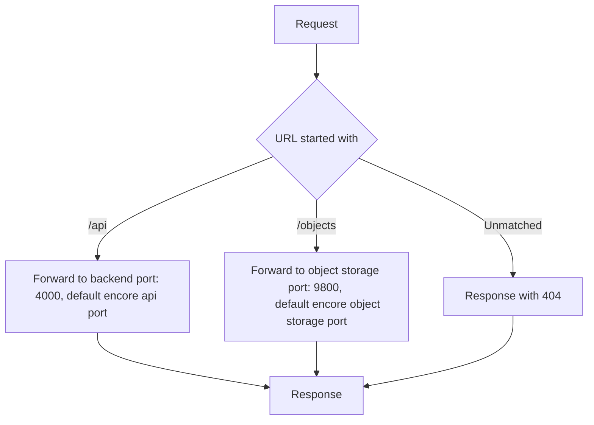

## A scoreboard for shooting sports (IPSC, IDPA, Action Air, 3-Guns)

## WIP

# Develeopment

## Flow
1. Setup both `.env` file inside `backend` and `frontend` folder.
2. `npm run dev` for both `backend` and `frontend`

# Backend proxy
To make the api and object storage api could be requested from same port. `backend\scripts\converging-services.js` is used to proxy the requests.

